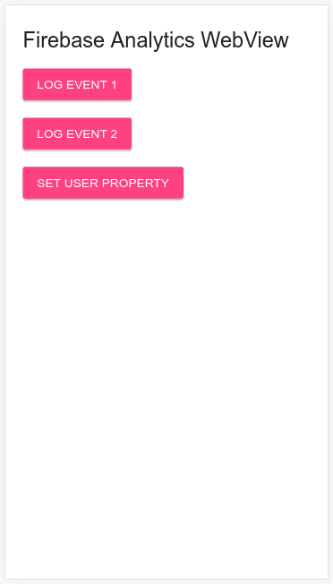

# Firebase Analytics WebView Quickstart

This sample will demonstrate how to use [Firebase Analytics](https://firebase.google.com/docs/analytics/)
in a WebView inside an Android or iOS app.

## Status

This sample is no longer actively maintained and is left here for reference only.

## Set Up

  * Follow the instructions for your chosen platform:
    * [Android](android/README.md)
    * [iOS](ios/README.md)
  * Enter the web directory (`cd web`) and run the following commands:
    * `npm install -g firebase-tools` - this will install the Firebase CLI.
    * `firebase login`
    * `firebase init`
      * Choose 'Hosting' when asked which feature you want to set up.
      * Choose the project you set up for your Android or iOS app.
      * Accept the defaults for all remaining prompts.
    * `firebase deploy --only hosting` - deploy to Firebase hosting.

## Run

  * Run either the Android or iOS app.
  * You should see a WebView that looks like this:
  
    
    
  * Clicking on the buttons will produce log output in your
    running application.
